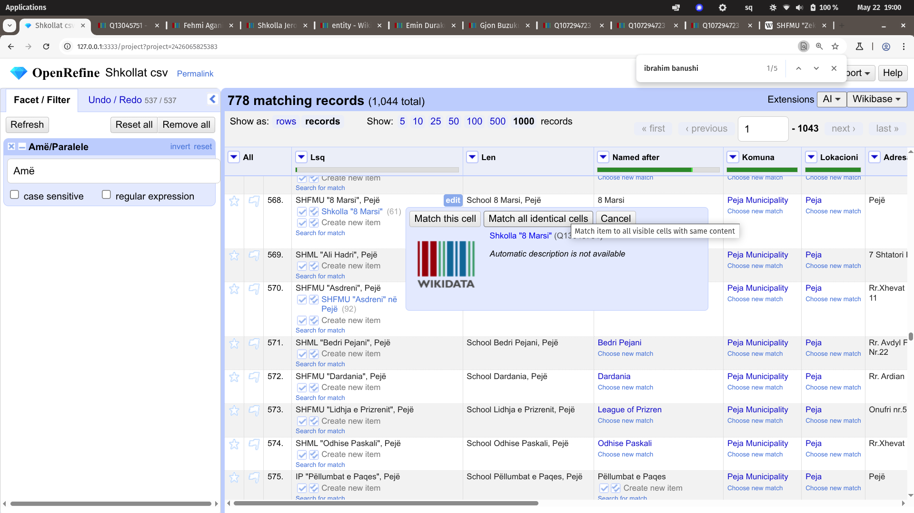
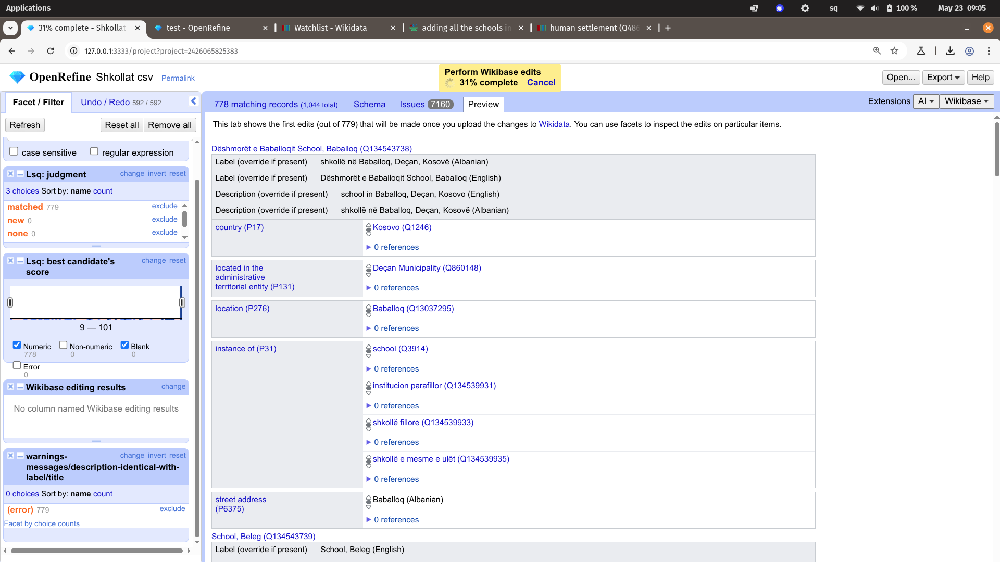

I had a list of schools in Kosovo I recieved from the Ministry of Education for more than a year now waiting to be refined and uploaded to Wikidata, yet hesitating to deal with it due to its messiness. According to various estimates, **data scientists spend [updwards of 60%](https://blog.ldodds.com/2020/01/31/do-data-scientists-spend-80-of-their-time-cleaning-data-turns-out-no/) of their time preparing and cleaning data** before analysis even begins. I got to appreciate this statistic while working with this dataset.

[Wikidata](https://wikidata.org) is a free and open knowledge base that can be read and edited by both humans and machines. It acts as a central storage for the structured data of Wikimedia projects such as Wikipedia, and it is used widely in academic research, digital humanities, and open data communities for linking, querying, and integrating. I have been contributing to it since 2012 and advocating since 2015 or so.

OpenRefine comes to the rescue.

[OpenRefine](https://openrefine.org/) is a powerful, open-source tool based on web technoloies to work with messy data: cleaning it, transforming it from one format into another, and reconciling it with external data sources such as Wikidata. It is often described as a "power tool for data wrangling" and is used by journalists, researchers, and data professionals. It look familiar to Excel yet it does not behave the same way and with a learning curve. Google bought OpenRefine but decied to hand it to the open source community (Google also operated an open data project called Freebase, which supported its Knowlege Graph, then merged it into Wikidata).

Through the Wikidata (and Wikimedia Commons) add-on, OpenRefine let's you reconcile and link with ease with existing items on Wikidata.

### The Challenge: Messy institutional spreadsheets

The Ministry of Education provided a spreadsheet listing schools across the country, with columns such as "Emri i shkolles" (School Name) and "Niveli i shkollësë" (School Level). Kosovo has **778 main schools** and **266 satellite school buildings**.

The first task was to transform the "Niveli i shkollësë" column into more readable, English-language labels, based on common education levels. I used OpenRefine's powerful GREL (General Refine Expression Language) to do this, mapping them to their Albanian-level names and acronyms. Here is a sample of some GREL transformation formula:

```GREL
if(cells["Niveli i shkollës"].value == "Parashkollor (Çerdhe)", "IP \"" + value + "\"",
  if(cells["Niveli i shkollës"].value == "Fillore", "SHF \"" + value + "\"",
    if(cells["Niveli i shkollës"].value == "Parafillor,Fillore", "SHF \"" + value + "\"",
      if(cells["Niveli i shkollës"].value == "Fillore,Mesme e ulët", "SHFMU \"" + value + "\"",
        if(cells["Niveli i shkollës"].value == "Parafillor,Fillore,Mesme e ulët", "SHFMU \"" + value + "\"",
          if(cells["Niveli i shkollës"].value == "Mesme e lartë", "SHML \"" + value + "\"",
            value
          )
        )
      )
    )
  )
)
```

This cleaned up one of the core columns and made it suitable for linking with items created in Wikidata on the types of schools that existin in Kosovo.

One recurring issue was the inconsistent naming of villages in Kosovo. Village names in the dataset were often non-standardized, with multiple spellings or alternative names used from what we have in Wikidata. This inconsistency complicates reconciliation with Wikidata, itself carrying this legacy on multiple-names for the same item. Addressing this requires a combination of fuzzy matching and manual review.

Uploading to Wikidata means not just cleaning data for presentation but preparing it for semantic interoperability. Every cleaned record is a potential structured statement that can enhance global knowledge -- or add more chaff -- to confuse Wikdiata users.



*Reconciling data to existing Wikidata items and creating new ones*



*Building the schema*

Lack of data dictionaries, overreliance on spreadsheets, and lack of semantic linkages can create quite a mess -- yet I wonder if Wikidata can make a positive contribution in this direction for governments. The path to clean, standardizeed data, whether for a Wikdiata contributor or an instiutional worker, might as well go through OpenRefine.

Want to connect about free public data, data cleaning or Wikidata? Feel free to reach out!
